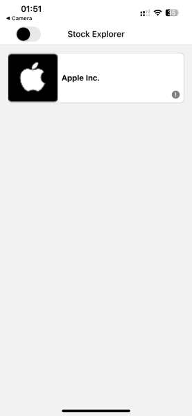
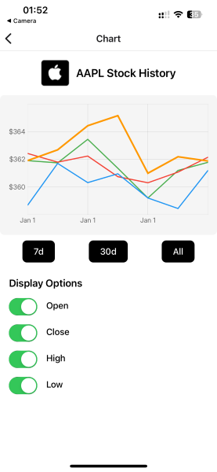
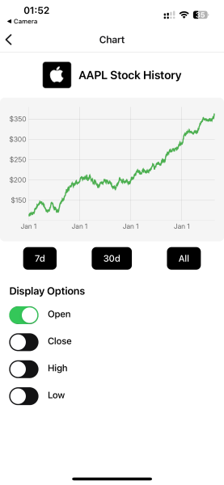
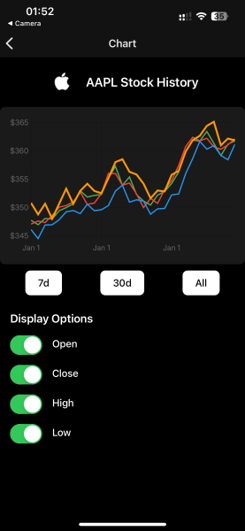

# Stocks Market

StocksMarket is a mobile application built with Expo and React Native that allows users to browse their stocks.






## Installation

### Prerequisites

- [Node.js](https://nodejs.org/)
- [Yarn](https://yarnpkg.com/)
- [Expo Go](https://expo.dev/client) app on iOS or Android

### Steps

**Install dependecies:**

```bash
yarn install
```

**Run the project locally**

```bash
yarn start
```

Scan the QR code displayed in the terminal or browser with Expo Go to launch the app.

**Run tests**

```bash
yarn test
```

## Features

- **Fully typed with TypeScript:**  
  All components, hooks, and utilities are written in strict TypeScript for improved safety and developer experience.
- **Native Navigation:**
  Smooth and performant screen transitions powered by @react-navigation/native-stack.
- **Dark/Light Theme Toggle:**  
  Theme switching via a header toggle using Zustand state management.
- **State Management:**  
  Zustand is used for managing theme.
- **Cross-Platform Responsive UI:**
  Polished, consistent design that works seamlessly on both Android and iOS.

### Potential Improvements

- Splash Screen & Icons: A polished first impression is crucial. Custom splash screens and adaptive icons would enhance professionalism.
- Dynamic loading of Stocks from an API/json to populate the main FlatList
- UI/UX Refinements: Further visual polish with smoother transitions, micro-interactions, and layout improvements.
- Localization: Add multi-language support to improve accessibility and usability for international users.
